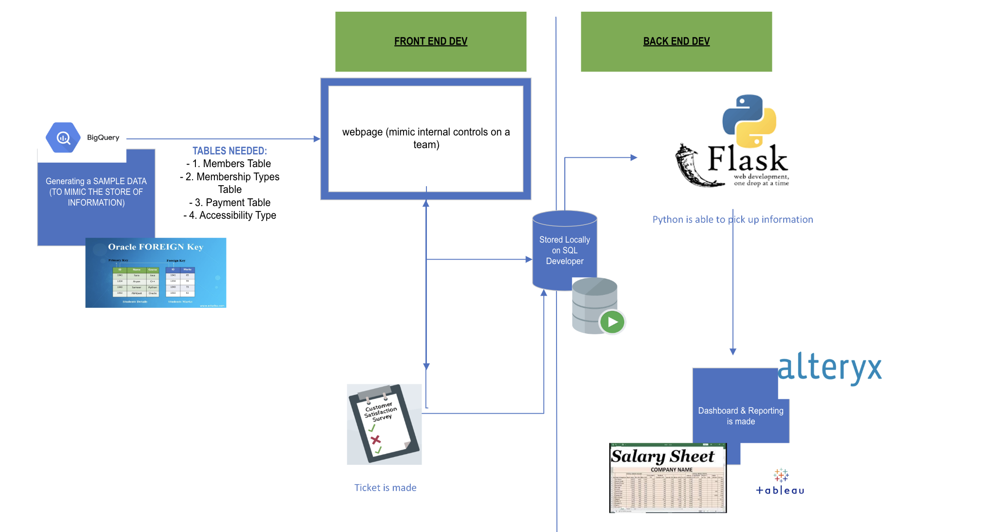

<!DOCTYPE html>
<html>
<body style="background-color: #f0f0f0;">
    <header>
        <h1>Database Systems - Membership Ticketing System</h1>
    </header>
    <nav class="section">
        <h2>Table of Contents</h2>
        <ul>
            <li><a href="#Problem">Problem</a></li>
            <li><a href="#Prototype">Mimic</a></li>
            <li><a href="#PyDeployment">Python Deployment</a></li>
            <li><a href="#Survey_Mechanism">Survey Mechanism</a></li>
            <li><a href="#Database_Modifications_in_SQL">SQL Modifications</a></li>
            <li><a href="#Integrating_Ticket_System">Ticket System</a></li>
            <li><a href="#Backend_Engineering">Backend Engineering</a></li>
            <li><a href="#Frontend_Interface">Frontend Interface</a></li>
            <li><a href="#Ticket_Based_Model">Ticket-Based Model</a></li>
            <li><a href="#Visuals">Visuals</a></li>
            <li><a href="#Resources">Resources</a></li>
        </ul>
    </nav>
    
    <section class="section" id="Problem">
        <!-- Content of the Problem section -->
        <h2>Problem</h2>
        <ul>
            <li><strong>Objective:</strong> Develop a comprehensive database system to manage and analyze membership data efficiently.</li>
            <li><strong>Scope:</strong> Includes database design, data import/export features, user access controls, and basic reporting capabilities. Does not include advanced analytics or integration with external systems.</li>
            <li><strong>Deliverables:</strong> A fully functional membership database, user manual, and a set of basic reports.</li>
        </ul>
    </section>

    
    <section class="section" id="Prototype">
        <!-- Content of the Summary section -->
        <h2>Mimic</h2>
        

            The Membership Management System Prototype developed features an integrated ticketing and survey mechanism, streamlining user interactions for database modifications in SQL. This approach bridges user requests and backend processing, enabling efficient tracking and execution of database amendments. The backend is engineered to simulate real-world scenarios, including appointment scheduling, medical record management, and personal data handling, utilizing randomized data sets for robust testing. The frontend of the system presents analytical insights in a user-friendly interface. A developer-centric ticket-based model enhances user engagement and operational efficiency.
        

        
        </section>
    <section class="section" id="PyDeployment">
        <h2>Python Deployment</h2>
        <!-- Content of the Web Dev section -->
        The intial stages requies a sql pull to be made from google bigquery. However, due to privacy and information from real data. It is difficult to find real-time data. As a result, python is used to create a sample data set that renders the same result. Reference the SQL Modification below for a quick overview. Essentially, we are able to do the following... 
    </section>

    
    </section>
    <section class="section" id="Survey_Mechanism">
        <h2>Survey Mechanism</h2>
        <!-- Content of the Survey Mechanism section -->
    </section>
    
    <section class="section" id="Database_Modifications_in_SQL">
        <h2>SQL Modifications</h2>
        <!-- Content of the SQL Modifications section -->
        This GitHub repository highlights the integration of JavaScript in managing and displaying data within a web-based environment. It demonstrates the creation and manipulation of data, primarily using JavaScript, to interact with Google BigQuery. The project exemplifies how JavaScript can be utilized for dynamic data handling and visualization, showcasing efficient data generation, retrieval, and presentation strategies. It serves as a practical guide for developers interested in applying JavaScript in big data scenarios, particularly in cloud-based platforms like Google BigQuery. For more information about process: 
https://github.com/dsrichard97/web_dep/tree/main
    </section>
    
    <section class="section" id="Integrating_Ticket_System">
        <h2>Ticket System</h2>
        <!-- Content of the Ticket System section -->
    </section>
    
    <section class="section" id="Backend_Engineering">
        <h2>Backend Engineering</h2>
        <!-- Content of the Backend Engineering section -->
    </section>
    
    <section class="section" id="Frontend_Interface">
        <h2>Frontend Interface</h2>
        <!-- Content of the Frontend Interface section -->
    </section>
    
    <section class="section" id="Ticket_Based_Model">
        <h2>Ticket-Based Model</h2>
        <!-- Content of the Ticket-Based Model section -->
    </section>
    
    <section class="section" id="Visuals">
        <h2>Visuals</h2>
        <!-- Content of the Visuals section -->
    </section>
    
    <section class="section" id="Resources">
        <h2>Resources</h2>
        <!-- Content of the Resources section -->
    </section>
    
</body>
</html>

